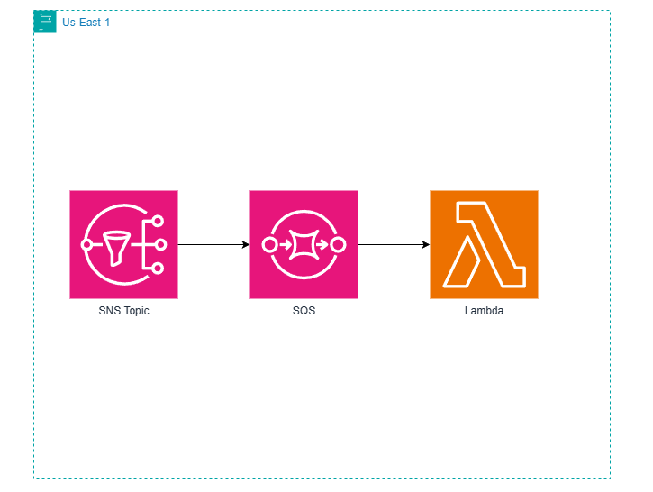
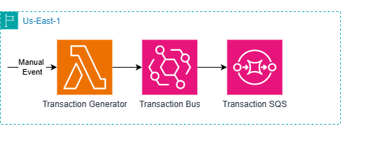

# AWS-Projects

## Overview
This repo contains a series of projects created to learn how to use the AWS CDK and other AWS technologies

### HelloWorldCDK

A project to learn the basics of creating CDK stacks and lambda handlers

#### Tech Stack:

CDK Stack: TypeScript

Lambda: Go, Docker

### Banking App (Under Construction)

#### Tech Stack:

CDK Stack: TypeScript

Transaction Generator: TypeScript

Transaction Record: Amazon Aurora

Account Status: Amazon Dynamodb

